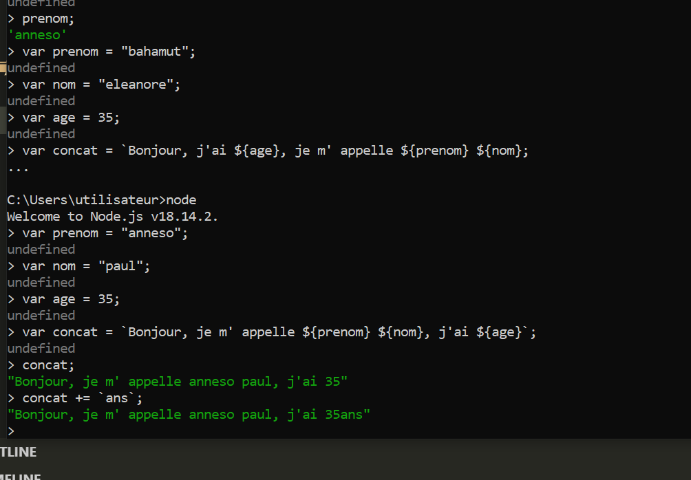
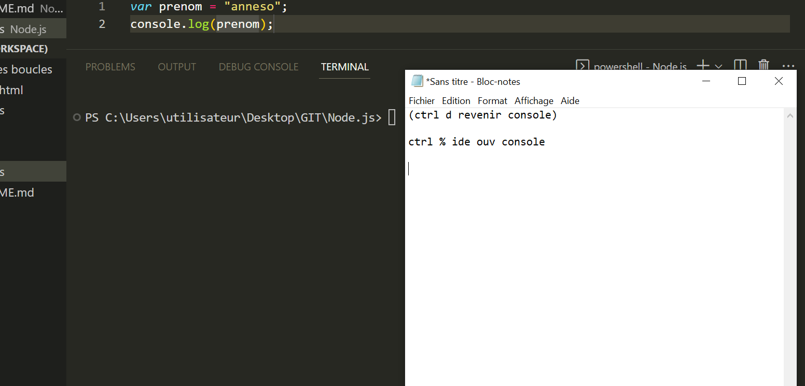

# Node.js  

Node.js est une plateforme logicielle libre en JavaScript, c'est une plateforme de bas niveau qui donne accès à des millions de bibliothèques.
Elle permet de créer des choses niveau serveur, et éxecuter du langage JS côté serveur.
Elle utilise une machine virtuelle, entre le serveur et l' utilisateur.
L' on peut insi éxecuter JavaScript n'importe où.

>Node.js est un environnement bas niveau permettant l'exécution de JavaScript côté serveur (server
side).

>Node.js est un environnement d’exécution single-thread, open-source et multi-plateforme permettant de créer des applications rapides et évolutives côté serveur et en réseau. Il fonctionne avec le moteur d’exécution JavaScript V8 et utilise une architecture d’E / S non bloquante et pilotée par les événements, ce qui le rend efficace et adapté aux applications en temps réel.

Exemple:
développer des API,...

>Note : Les APIs et les Web services servent de moyen de communication. La seule différence est
qu’un service Web facilite l’interaction entre deux machines sur un réseau. Une API agit comme
une interface entre deux applications différentes afin qu’elles puissent communiquer entre elles.

## Node.js depuis la console

Pour installer Node sur votre machine, il vous suffit de vous rendre sur le site officiel de Node et de
télécharger la version LTS compatible avec le système d’exploitation de votre ordinateur, puis de l’installer. 
En installant Node l’installation de **NPM** (Node Package Manager; cela permet la gestion des packages = bibliothèques tiers.) se fait de manière automatique. Pour vérifier les versions rendez vous sur votre terminal puis tapez :

Grâce à Node nous pourrons écrire et éxecuter du JS via le terminal.Il n' y a pas d' enregistrement, c'est une **machine virtuelle**.
Pour utiliser node il suffit de taper: node.
L' on peut ainsi écrire du JS directement sur la console.
## Node.js depuis IDE

Lancement dans terminal: node nomfichierjs.

## Accès à des bibliothèques mais plus encore

JavaScript nous donne accès au DOM et au BOM (Browser Object Model).
Avec Node.js on a accès à des **objets globaux**.

Exemples:
variables environnement, OS,... sont des objets globaux.

### Qu'est ce qu'un objet?

Avant de découvrir **l’ objet global et les objets globaux** il faut savoir ce qu'est un objet.
JavaScript est conçu autour d'un paradigme simple, basé sur les objets. Un objet est un ensemble de propriétés et
une propriété est une association entre un nom (aussi appelé clé) et une valeur. En JavaScript, pour
définir un objet, il faut ouvrir les accolades. À l'instar de nombreux autres langages de programmation, on peut comparer les objets JavaScript aux objets du monde réel. Imaginons un véhicule, une voiture est un objet les propriétés de cet objet sont toutes définies sur la carte grise (ex: chevaux fiscaux ) pour écrire cela nous procéderons comme ceci:

    var objet = {
        i: 10,
        b: () => console.log(this.i, this),
            // valeur de i et valeur de l'objet
        c: function (){
            console.log(this.i, this);
        }
    };
    ->Voir vehicule.js
>Pour accéder à une propriété de l’objet depuis l'extérieur de cet objet, il faut écrire le nom de cet
objet suivi par celui de la propriété, le tout séparé par un point. Pour y accéder depuis l'intérieur de
cet objet nous utiliserons le context ( le this ) qui fait référence à lui même. Ces propriétés peuvent
être de tout type, y compris des fonctions, mais attention les fonctions fléchées sont destinées à être
anonymes même si ont peut leur donner un nom, comme dans le chapitre précédent avec la fonction fléchée salut. À l'inverse, les propriétés d’un objet sont destinées à être dûment nommés, ce qui rend inapproprié les fonctions fléchées dans un objet.
(Voir main.js)

On peut voir que l’objet global nous renvoie des fonctions que nous pouvons utiliser sans faire appel à un
module en particulier. Nous avons accès à des méthodes comme clearInterval ou setInterval sans rien importer dans notre fichier.

    setInterval(() => {
    console.log("Salut");
    }, 3000);
Le code ci-dessus affichera Salut dans la console après 3 secondes sans avoir à importer un  module. Certains objets comme les variables suivantes n’existent que dans le cadre des modules, elles peuvent sembler globales mais ne le sont pas vraiment :
❖ __dirname
❖ __filename
❖ exports
❖ module
❖ require()
Comme nous pouvons le voir l’objet (__dirname) se comporte comme les objets globaux dans un script mais pas dans le cmd.
Lesmodules.
Un « module » en programmation correspond à un bloc cohérent de code, c’est-à-dire à un bloc de
code qui contient ses propres fonctionnalités fonctionnant ensemble et qui est séparé du reste du
code. Généralement, un module possède son propre fichier. L’avantage principal des modules est
une meilleure séparation qui résulte dans une meilleure maintenabilité et lisibilité du code. Créons
notre module que nous allons appeler Simplon.js :

### Objet global et objets globaux

Voir global.js.
// renvoie fonctions qui peuvent être utilisées sans faire appel à un module particulier, sans rien importer dans le fichier
    console.log(global);
    -> pas de navigateur mais pourtant objet global apparaît

Certains objet qui n' existent que dans le cadre des modules, ressemblent à un objet global mais ne sont pas les mêmes.

Un objet global n' a pas besoin d' être défini.
**objet global pas besoin de donner le chemin**

Exemples:
[__dirname](https://www.digitalocean.com/community/tutorials/nodejs-how-to-use__dirname)

## Qu' est ce qu'un module?

C 'est unbloc cohérent de code, qui contient ses propres fonctions, qui fonctionnent ensemble et sont séparés du reste du code.
Cela permer unemeilleure séparation du code,ainsi qu'une meilleure maintenabilité et lisibilité du code.
Cela rend également l' application plus légère, ne charge pas tout, plus rapide.

Voir simplon.js:
on peut voir que simplement en faisant un require (importation) de notre module depuis le fichier
main.js notre module simplon est accessible. Mais essayons de déplacer le console.log de notre module à notre fichier intro et voyons ce qui se passe : "it's not defined".

Afin de pouvoir les rendre accessibles et utilisables on va pouvoir exporter des modules entiers ou des éléments de certains modules (on dit également qu’on **expose** ces éléments).
On peut donc aussi importer plusieurs éléments d’un même module, ce que l’on appelle le **destructuring**.
Nous avons aussi accès aux modules directement intégrés lors de l'installation de node comme par exemple os pour operating system ou fs pour file system.

## Module fs

Le module fs fournit de nombreuses fonctionnalités très utiles pour accéder et interagir avec le
système de fichiers. La particularité du module fs est que toutes les méthodes sont asynchrones par défaut, mais elles peuvent également fonctionner de manière synchrone en ajoutant sync. Par
exemple, fs.access pour la méthode asynchrone ou fs.accessSync pour la méthode synchrone.

    const system = require("fs");
## Manipulation console

- ctrl d: revenir console
- ctrl c: stop
- ctrl %: ouverture
- nom -v: version
- mysql: mysql -u root -p

## Requête http

http -> nom de domaine, représente la position, 
url -> Uniform Resource Locator. Manière uniforme d' accès à des ressources.Adresse.

Constoituée de:
|protocol| domaine| port| ressource|
|------:|-------:|-----:|-------:|
|http://| 178.128.195.113| :3000|/-formation|

- Le protocole HTTP, littéralement « protocole de transfert hypertexte », est un protocole de communication client-serveur développé pour le World Wide Web. HTTPS est la variante sécurisée par le chiffrement et l'authentification.
- Le domaine représente l’adresse logique de la machine connectée sur le réseau, ici 178.128.195.113 représente le nom de domaine simplon.co.
- Le port permet de donner une identité de processus d’un site sur une machine (serveur) qui peut en
contenir plusieurs. Pour simplifier, on peut considérer les ports comme des portes donnant accès au
système d’ exploitation.
- La ressource permet de spécifier quel fichier lire sur le site. Chaque fichier est considéré comme
une page du site.

Lorsque l’utilisateur valide une URL dans la barre d’ URL, le client (le navigateur) envoie une
requête HTTP au serveur qui répond en renvoyant l’ élément demander dans un format donné (
HTML, JSON, Jpeg, mp3 ...). On appelle cela la **communication**.

**Node js permet à une machine de se comporter comme un serveur avec response request**. Voir dossier nodeServer.

>Node est asynchrone, pour utiliser les méthodes de facon synchrone après fonction mettre **sync**.

http protocol requête utilise deux objets:
**request et response**,qui renvoie l' objert response,obejt qui peut être une instance de l'objet error,
ou une instance de la classe error.

## La gestion des erreurs

Un objet error est un objet qui est soit une instance de l’objet error, soit étend la classe error, fournie
dans le module principale error.
Un gestionnaire d'exceptions est une instruction /.Try Catch. Toute exception soulevée dans les
lignes de code incluses dans le bloc est gérée dans le bloc correspondant.

    throw new Error("erreur");

    try{
        noExistFunction();
    }catch (error){
        console.error("erreur", error);
    }
En utilisant des promesses, vous pouvez enchaîner différentes opérations et gérer les erreurs à la
fin :
    doSomething1()
    .then(doSometing2);
    .then(doSometing3);
    .catch(Err => console.error(Err));

## Compléments terminal, invit et usage node.je

